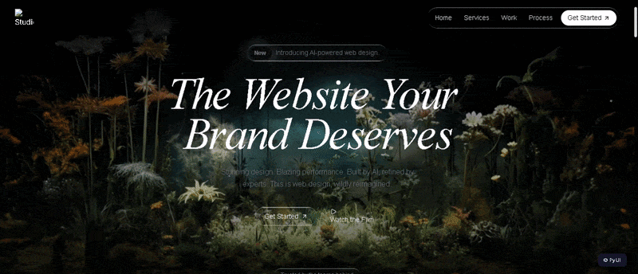

# Zolt

> **Write Python. Render anywhere.**  
> Web · Desktop · Terminal — from a single Python codebase.

[](https://pypi.org/project/zolt)
[](https://python.org)
[](LICENSE)
[](https://github.com/12errh/Zolt/actions)

Zolt is a production-ready Python UI framework. Write your entire UI in pure Python — no HTML, no CSS, no JavaScript. One codebase compiles to a web app, a native desktop window, and a terminal UI.

---

## See it in action

### Reference design (motionsite.ai)


### Built with Zolt — pure Python, zero HTML


> The agency landing page above — glassmorphism effects, HLS video backgrounds, animated headings, floating navbar — is **100% Python**. No HTML templates. No CSS files. No JavaScript written by hand.
> Scaffold it yourself: `zolt new my-agency --template agency`

---

## Install

```bash
pip install zolt
```

Requires Python 3.10+.

---

## Quick start

```bash
zolt new my-app
cd my-app
zolt run          # → http://localhost:8000
```

Browse all templates interactively:

```bash
zolt templates
```

Available templates: `blank` · `dashboard` · `landing` · `admin` · `auth` · `agency`

---

## Hello World

```python
from pyui import App, Button, Flex, Heading, Page, Text, reactive

class HomePage(Page):
    title = "Home"
    route = "/"

    def compose(self):
        with Flex(direction="col", align="center", gap=6):
            Heading("Hello from Zolt", level=1)
            Text("Built with pure Python.").style("muted")
            Button("Get Started").style("primary").size("lg")

class MyApp(App):
    name = "My App"
    home = HomePage()
```

Run it:

```bash
zolt run app.py                    # web browser → http://localhost:8000
zolt run app.py --target desktop   # native tkinter window
zolt run app.py --target cli       # Rich TUI in the terminal
```

---

## Reactive state

```python
from pyui import App, Button, Flex, Page, Text, reactive

_count = reactive(0)

class CounterPage(Page):
    title = "Counter"
    route = "/"

    def compose(self):
        with Flex(direction="col", align="center", gap=4):
            Text(lambda: f"Count: {_count.get()}").style("lead")
            with Flex(gap=3):
                Button("−").style("ghost").onClick(lambda: _count.set(_count.get() - 1))
                Button("+").style("primary").onClick(lambda: _count.set(_count.get() + 1))

class CounterApp(App):
    count = _count
    home = CounterPage()
```

---

## Agency landing page template

The `agency` template scaffolds a complete dark premium landing page — the same one shown in the GIF above.

```bash
zolt new my-agency --template agency
cd my-agency
zolt run
```

What you get:

```
my-agency/
├── app.py              ← App + Page wiring
├── styles.py           ← Liquid glass CSS, custom fonts, animations
└── sections/
    ├── navbar.py       ← Fixed glassmorphism pill nav (FloatingNav)
    ├── hero.py         ← Full-viewport video bg + animated heading
    ├── features_chess.py  ← Alternating text/gif rows
    ├── features_grid.py   ← 4-column feature cards
    ├── start.py        ← HLS video bg "How It Works" section
    ├── stats.py        ← Desaturated HLS video + stat card
    ├── testimonials.py ← 3-column quote cards
    └── cta_footer.py   ← HLS video bg + CTA + footer
```

All sections use Zolt components — `Section`, `VideoBg`, `BlurHeading`, `FloatingNav`, `Link` — no raw HTML.

---

## 47+ built-in components

| Category | Components |
|---|---|
| Layout | `Flex`, `Grid`, `Stack`, `Container`, `Section`, `Sidebar`, `Split`, `Divider`, `Spacer`, `List` |
| Display | `Text`, `Heading`, `BlurHeading`, `Badge`, `Tag`, `Avatar`, `Icon`, `Image`, `Link`, `Markdown` |
| Input | `Button`, `Input`, `Textarea`, `Select`, `Checkbox`, `Radio`, `Toggle`, `Slider`, `DatePicker`, `FilePicker`, `Form` |
| Feedback | `Alert`, `Toast`, `Modal`, `Drawer`, `Tooltip`, `Progress`, `Spinner`, `Skeleton` |
| Navigation | `Nav`, `FloatingNav`, `Tabs`, `Breadcrumb`, `Pagination`, `Menu` |
| Data | `Table`, `Stat`, `Chart` (line, bar, pie via Chart.js) |
| Media | `Video`, `VideoBg` |

### New in v1.2

| Component | What it does |
|---|---|
| `BlurHeading` | Word-by-word blur-reveal animated heading. Instrument Serif italic, fluid `clamp()` sizing. |
| `Link` | Semantic `<a>` with `glass`, `primary`, `nav`, `footer` style variants + Lucide icon. |
| `Section` | `<section>` wrapper with `position:relative` — the foundation for video-background layouts. |
| `VideoBg` | Absolutely-positioned background video. HLS via hls.js, gradient fades, desaturate filter. |
| `FloatingNav` | Fixed glassmorphism pill navigation bar with logo, links, and CTA button. |

### `inlineStyle()` — escape hatch for any CSS value

```python
Flex(direction="col")
    .inlineStyle("padding-top:clamp(6rem,14vh,10rem);z-index:10;")
```

Use this for CSS values Tailwind CDN can't scan — `clamp()`, `text-shadow`, custom `z-index`.

---

## 6 built-in themes + theme switching

```python
class MyApp(App):
    theme = "dark"   # light · dark · ocean · sunset · forest · rose
```

Custom theme:

```python
class MyApp(App):
    theme = {"color.primary": "#FF6B6B", "color.background": "#FFF5F5"}
```

Theme switching works at runtime — click a theme in the storybook or call `pyuiSetTheme('dark')` from any button.

---

## App configuration

```python
class MyApp(App):
    name = "My App"
    description = "Built with Zolt."
    theme = "dark"
    extra_css = "/* custom CSS injected into every page */"
    head_scripts = ["https://cdn.jsdelivr.net/npm/hls.js@1.6.15/dist/hls.min.js"]
    favicon = "/images/favicon.ico"
    plugins = [MyPlugin()]
    home = HomePage()
```

---

## CLI reference

| Command | Description |
|---|---|
| `zolt new <name>` | Scaffold a new project (`--template blank\|dashboard\|landing\|admin\|auth\|agency`) |
| `zolt templates` | Browse all templates interactively and scaffold one |
| `zolt run [app.py]` | Start dev server with hot reload (`--target web\|desktop\|cli`) |
| `zolt build [app.py]` | Production build (`--target web\|desktop\|cli\|all`) |
| `zolt storybook` | Open component gallery on port 9000 |
| `zolt doctor` | Check environment health (Python, deps, ports, PyPI version) |
| `zolt lint [app.py]` | Lint component definitions |
| `zolt search <query>` | Search PyPI for `zolt-*` packages |
| `zolt publish` | Publish a component package to PyPI |
| `zolt info` | Show version info |

---

## Plugin system

```python
from pyui.plugins import PyUIPlugin, register_component

class ChartsPlugin(PyUIPlugin):
    name = "zolt-charts"
    version = "1.0.0"

    def on_load(self, app):
        register_component("LineChart", LineChartComponent)

class MyApp(App):
    plugins = [ChartsPlugin()]
```

Lifecycle hooks: `on_load`, `on_compile_start`, `on_compile_end`, `on_build`, `on_dev_start`

---

## Example apps

Six full example apps in [`examples/`](examples/):

| App | Description | Run |
|---|---|---|
| [`agency/`](examples/agency/app.py) | Dark premium AI agency landing page | `zolt run examples/agency/app.py` |
| [`dashboard/`](examples/dashboard/app.py) | Analytics dashboard with stats, chart, table | `zolt run examples/dashboard/app.py` |
| [`todo/`](examples/todo/app.py) | Reactive todo list | `zolt run examples/todo/app.py` |
| [`blog/`](examples/blog/app.py) | Content site with routing | `zolt run examples/blog/app.py` |
| [`ml-demo/`](examples/ml-demo/app.py) | ML inference UI | `zolt run examples/ml-demo/app.py` |
| [`admin/`](examples/admin/app.py) | CRUD admin panel | `zolt run examples/admin/app.py` |

---

## What's included in v1.2

- ✅ Web renderer (HTML + Tailwind CSS CDN + Alpine.js)
- ✅ Desktop renderer (tkinter with sv-ttk theme)
- ✅ CLI renderer (Rich TUI)
- ✅ Reactive state (`reactive`, `computed`, `store`, `persist=True` → localStorage)
- ✅ Theme engine (6 built-in themes + custom token dict + Figma export)
- ✅ Runtime theme switching (`pyuiSetTheme()`)
- ✅ Plugin system with lifecycle hooks
- ✅ Hot reload (file save → browser update, <200ms)
- ✅ Dev tools panel (state inspector, event log, page navigator)
- ✅ Error overlay with structured error codes (`PYUI-NNN`)
- ✅ `zolt lint` — component tree validation
- ✅ `zolt doctor` — environment health check
- ✅ `zolt storybook` — interactive component gallery
- ✅ `zolt templates` — interactive template browser
- ✅ `App.extra_css` — inject custom CSS into every page
- ✅ `App.head_scripts` — inject CDN scripts into `<head>`
- ✅ `BaseComponent.inlineStyle()` — raw inline CSS on any component

---

## Deployment

Build a static bundle and deploy anywhere:

```bash
zolt build app.py --target web --out dist
```

Then deploy `dist/` to:
- **Vercel:** `vercel dist`
- **Netlify:** `netlify deploy --dir dist --prod`
- **GitHub Pages:** push `dist/` to `gh-pages` branch
- **Cloudflare Pages:** `wrangler pages deploy dist`

---

## What's next — v1.5

v1.5 replaces the Tailwind CSS dependency with **ZoltCSS** — Zolt's own styling engine. Zero CDN. Zero class names visible to the developer. One style declaration produces correct output for web, Qt desktop, and terminal.

Other v1.5 pillars: GSAP animation engine, Three.js 3D engine, 80+ prebuilt Zolt UI components, Figma import, Qt5/Qt6 desktop upgrade, and AI skill files for 100% API coverage.

See [`docs/Zolt_v1_5_PRD_TRD_Final.md`](docs/Zolt_v1_5_PRD_TRD_Final.md) for the full plan.

---

## Contributing

See [CONTRIBUTING.md](CONTRIBUTING.md). Issues labelled [`good-first-issue`](https://github.com/12errh/Zolt/issues?q=label%3Agood-first-issue) are a great place to start.

## License

MIT — see [LICENSE](LICENSE).
